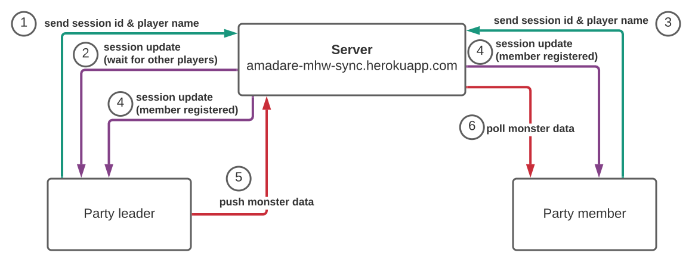

# Amadare's Sync Plugin

This plugin allows syncing monster buildup data from party-leader to other party members using central server.

## How it works

Since Monster Hunter World doesn't store monster part HP and ailments buildup for non-leader party members in memory, HunterPie cannot show these values in overlay. To handle this problem, Sync Plugin will send **session id**, monster hunter's **character name** and **role** (leader, non-leader) to external server. When on for single session at least one leader and one other member registered, leader will send **parts hp** and **ailments buildup** information that will be propagated to all other members.

To reduce traffic and server load, connection will not be opened for expeditions with only single member. And client will automatically disconnect if no other members connect in 3 minutes. That because application cannot know if any of them have HunterPie with sync plugin installed.

#### Explanation of whole process (simplified):


1. Party leader sends session information and waits for server message
2. Party leader receives message that no other members are present in session, so it waits for others
3. Non-leader member sends session information and waits for server message
4. Server sends session update to both clients, allowing leader to push monster data and non-leader members to receive it
5. When monster data changes, leader sends changes information to server
6. Non-leader members receive changes and apply it to HunterPie's internal monsters state, so overlay will display correct values

## Configuration

On first run, in plugin directory `config.json` file will be created. It will be loaded as configuration on plugin initialization.

`LogLevel`: set verbosity of plugin logging (Trace, Debug, Warn, Info, Error). Note that this will ignore core application settings. 

`ServerUrl`: change sync server url. Useful when using local server

It is also possible to configure server logging with `ServerLogging` object:
```
{
    Enable: true,
    Name: 'your-name',
    Room: 'room unique id to discern'
}
```

**What will be sent to server**: all plugin-related logs that user can see in application, along time, specified name.